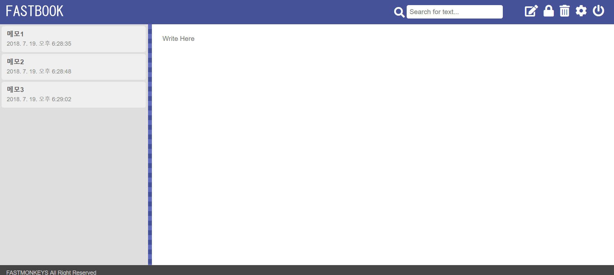

## 사이트 이미지

## 작업기간
FastBook(​18.06.25 ~ 18.07.06​, 패스트캠퍼스)

## 프로젝트 링크
[FastBook](https://fastbook-memoapp.netlify.com)

## 기능
로그인

회원가입

추가,삭제,잠금,찾기

## 작업내용
macbook 의 메모장 앱을 구현한 웹 어플리케이션입니다.

로그인 기능 구현 및 회원가입 기능 구현

react-create-app을 이용하여 구현

glitch서버와 통신하여 json 통신 방식을 통해 data 구현

메모 검색 기능을 통하여 찾고 싶은 메모 빠른 탐색 기능 구현

