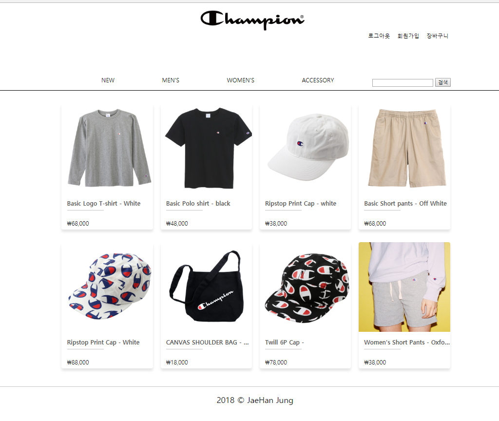

## 사이트 이미지

## 작업기간
shopping-mall(​18.05.28 ~ 18.06.03​, 패스트캠퍼스)

## 프로젝트 링크
[shopping-mall](https://han-shopping-mall.netlify.com)

## 작업내용
html template 을 사용하여 태그의 모듈화 연습

react를 배우기전 태그 모듈화 과정연습

glitch서버와 통신하여 json 통신 방식을 통해 data 구현

서버와 통신하는데 오래걸리는게 단점.

로그인, 회원가입, 상품정보를 서버 통신 방식 을 통해 구현

template 으로 모듈화된 정보를 화면에 보여지게 하고 모듈화 방식을 사용하긴 했지만 따로 파일을 나누지 않아서 코드가 길어지고 찾기 힘들다.

React를 배우기전이라 컴포넌트를 나누는 방법을 모른체 만들어본 프로젝트

